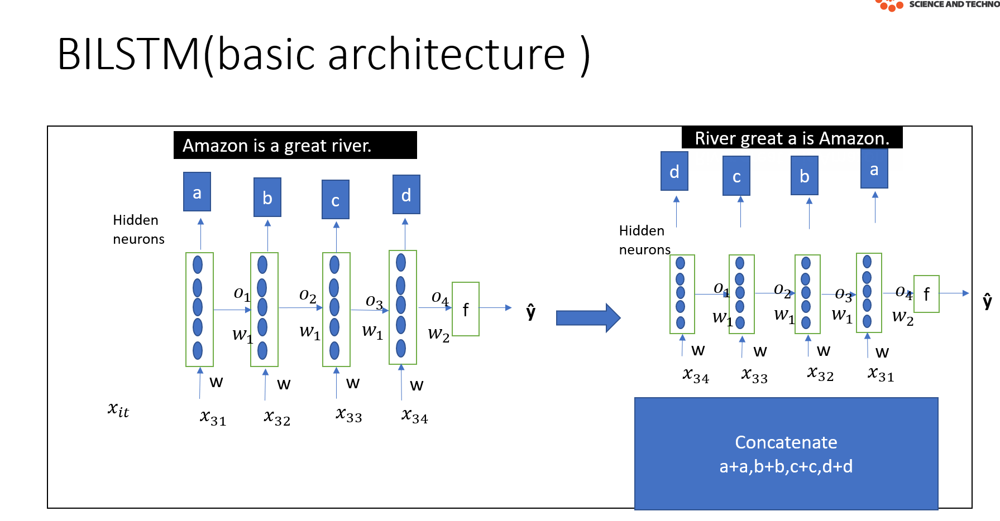
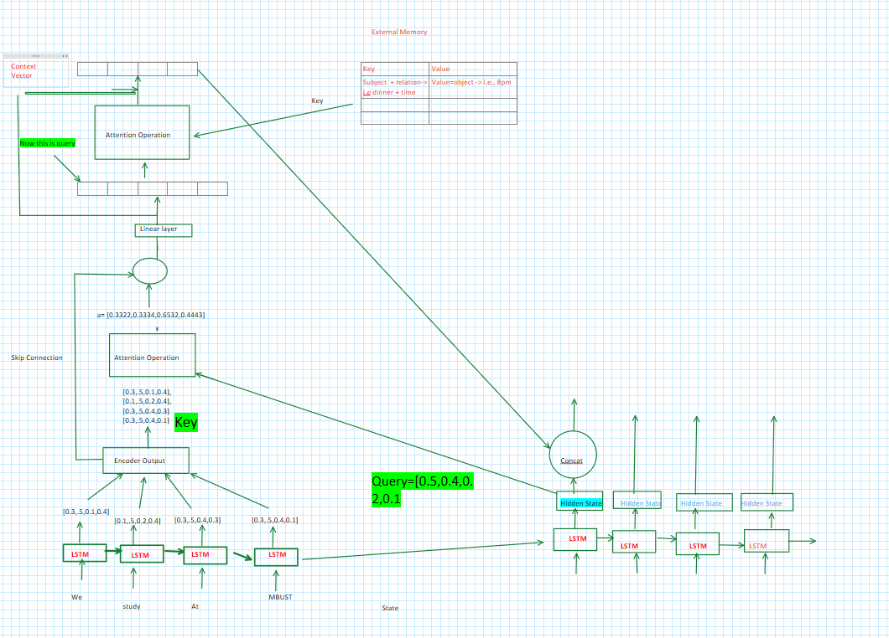

# Understanding Bidirectional LSTM (BiLSTM)

## BiLSTM
General LSTM works from left right. Like from input side to output side. data flow and processing happens from left to right. but in most of times when we read sentence we only know the meaning of word while we read sentences after that word. So to solve this problems , bilstm comes . It will pass forward direction and again it will backword similar to normal lsmt and we concanate the  hidden state of both forward lstm and backword lstm. 

Examples:
* "We find Suman at Restaurant,he had wared black shoes. "
*  "We find Suman at Restaurant,it was faded."

This is particularly useful in language Translation like from Nepali to English. Because when we translate from Nepali to english we have to see words next to that word.
* I am Suman Khatri. 
* Ma Suman Khatri Ho.

In our case,"Key Value retrival network" we use bilstm only in incoder side not in decoder side. 

Why we only use bilstm in incoder only? 

##  BiLSTM Architecture

 

### Key Components:
- Input sequence
- run one Forward LSTM (from t=1 to t=T,`[past -> future]`)
- run another Backward LSTM (from t-T to t=1,`[future -> past]`)
- Concatenation of hidden states
- Output layer

### Mathematical Formulation

#### Notation:
- $x_t$: Input vector at timestep \(t\)
- $\overrightarrow{h_t}$: Forward hidden state at \(t\)
- $\overleftarrow{h_t}$: Backward hidden state at \(t\)
- $T$: Total timesteps in sequence
- $\sigma$: Sigmoid activation function
- $\odot$: Element-wise  

---

#### Forward LSTM (Past → Future):
Computes hidden states from \(t=1\) to \(t=T\):

$
\begin{aligned}
\overrightarrow{i_t} &= \sigma(W_{xi}^f x_t + W_{hi}^f \overrightarrow{h_{t-1}} + b_i^f) \\
\overrightarrow{f_t} &= \sigma(W_{xf}^f x_t + W_{hf}^f \overrightarrow{h_{t-1}} + b_f^f) \\
\overrightarrow{o_t} &= \sigma(W_{xo}^f x_t + W_{ho}^f \overrightarrow{h_{t-1}} + b_o^f) \\
\overrightarrow{\tilde{c}_t} &= \tanh(W_{xc}^f x_t + W_{hc}^f \overrightarrow{h_{t-1}} + b_c^f) \\
\overrightarrow{c_t} &= \overrightarrow{f_t} \odot \overrightarrow{c_{t-1}} + \overrightarrow{i_t} \odot \overrightarrow{\tilde{c}_t} \\
\overrightarrow{h_t} &= \overrightarrow{o_t} \odot \tanh(\overrightarrow{c_t})
\end{aligned}
$

---

#### Backward LSTM (Future → Past):
Computes hidden states from \(t=T\) to \(t=1\):

$
\begin{aligned}
\overleftarrow{i_t} &= \sigma(W_{xi}^b x_t + W_{hi}^b \overleftarrow{h_{t+1}} + b_i^b) \\
\overleftarrow{f_t} &= \sigma(W_{xf}^b x_t + W_{hf}^b \overleftarrow{h_{t+1}} + b_f^b) \\
\overleftarrow{o_t} &= \sigma(W_{xo}^b x_t + W_{ho}^b \overleftarrow{h_{t+1}} + b_o^b) \\
\overleftarrow{\tilde{c}_t} &= \tanh(W_{xc}^b x_t + W_{hc}^b \overleftarrow{h_{t+1}} + b_c^b) \\
\overleftarrow{c_t} &= \overleftarrow{f_t} \odot \overleftarrow{c_{t+1}} + \overleftarrow{i_t} \odot \overleftarrow{\tilde{c}_t} \\
\overleftarrow{h_t} &= \overleftarrow{o_t} \odot \tanh(\overleftarrow{c_t})
\end{aligned}
$

---

#### State Combination:
At each timestep \(t\), concatenate forward and backward states:

$
h_t = \begin{bmatrix} \overrightarrow{h_t} \\ \overleftarrow{h_t} \end{bmatrix} \quad \text{(Concatenation)}
$

---

#### Output Calculation:
$
y_t = g(W_y h_t + b_y)
$
Where:
- $g$ = task-specific activation (e.g., softmax for classification)
- $W_y $ = output weight matrix
- $b_y$ = output bias

---

#### Key Properties:
1. **Parameter Independence**:  
   Forward ($\theta^f$) and backward $\theta^b$ parameters are distinct and trained separately
   
2. **Gradient Flow**:
   $
   \frac{\partial \mathcal{L}}{\partial \theta} = \frac{\partial \mathcal{L}}{\partial \theta^f} + \frac{\partial \mathcal{L}}{\partial \theta^b}
   $

3. **Sequence Requirements**:  
   Backward pass requires full sequence $\langle x_1, x_2, ..., x_T \rangle$ upfront

 ##  BiLSTM with attention and external memory Architecture

 `Please zoom out for better clearity.`